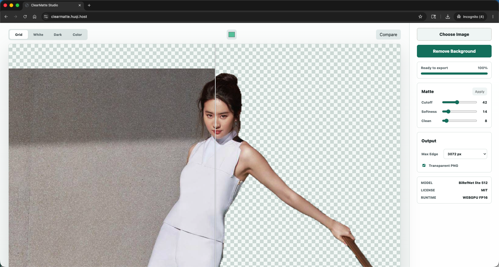

# ClearMatte Studio

[中文说明](./README-zh.md)

ClearMatte Studio is a static browser app for background removal. It runs client-side with Transformers.js and the `studioludens/birefnet-lite-512` ONNX model.



## Features

- Upload PNG, JPEG, or WebP images.
- Run alpha matting locally in the browser.
- Preview transparent results on grid, white, dark, or custom backgrounds.
- Adjust cutoff, softness, and cleanup before export.
- Export transparent PNG or a flattened color-background PNG.

## Run Locally

```bash
python3 -m http.server 5173
```

Open `http://localhost:5173`.

WebGPU requires a secure context. `localhost` works in modern browsers; unsupported browsers fall back to WASM.

## Model Downloads

Model files load from the Hugging Face Hub by default. Mainland China visitors are automatically routed to `hf-mirror.com` based on browser timezone or language.

Testing overrides:

- `?mirror=1` forces the China mirror.
- `?mirror=0` forces the Hugging Face Hub.

## Deploy

Deploy the repository as static files behind HTTPS. No build step or server runtime is required.
